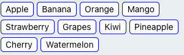
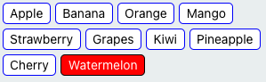

# react-native-choice-button
Install the package:

```bash
$ npm i react-native-choice-button --save
```

Import the ``Button`` component:

```javascript
import ChoiceButton from 'react-native-choice-button'
```

## Usage

```javascript
    const data = [{id: 1, name: '1bc'}]
    <ChoiceButton  
        data={data}
        onPressCallback={(name, id) => {
          console.log(`Button pressed: name=${name}, id=${id}`);
        }}
    />
```

## Example
<table>
   <tr>
      <td>
          
      </td>
      <td>
          
      </td>
    </tr>
</table>

## API

| Prop | Type | Description |
|------|------|-------------|
| ``onPressCallback`` | ``func`` | Function to execute when the ``onPress`` event is triggered. |
| ``customContainerStyle`` | ``ViewStyle`` | The StyleSheet to apply to the root view |
| ``customButtonStyle`` | ``ViewStyle`` | The StyleSheet to apply to the button view |
| ``customTextStyle`` | ``TextStyle`` | The StyleSheet to apply to the text |
| ``width`` | ``number`` |                                 |
| ``height`` | ``number`` |                                |
| ``bgColor`` | ``string`` |                               |
| ``fontSize`` | ``number`` |                              |
| ``fontFamily`` | ``string`` |                            |
| ``borderColor`` | ``string`` |                           |
| ``borderWidth`` | ``number`` |                           |
| ``borderRadius`` | ``number`` |                          |
| ``marginVertical`` | ``number`` |                        |
| ``selectedBgColor`` | ``string`` |                       |
| ``selectedBdColor`` | ``string`` |                       |
| ``paddingVertical`` | ``number`` |                       |
| ``borderRadius`` | ``number`` |                          |
| ``marginHorizontal`` | ``number`` |                      |
| ``defaultTextColor`` | ``string`` |                      |
| ``selectedTextColor`` | ``string`` |                     |
| ``paddingHorizontal`` | ``number`` |                     |